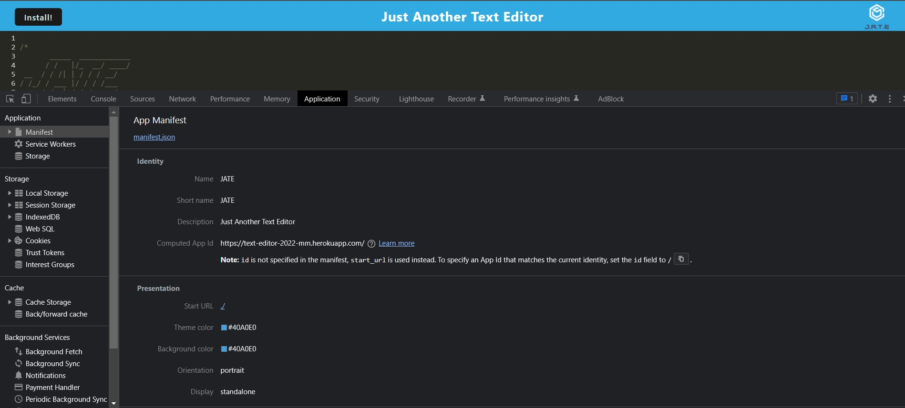
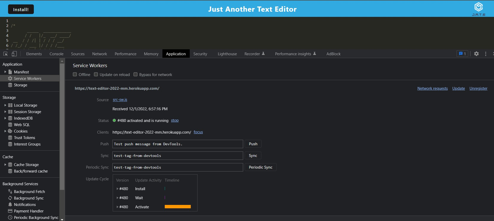
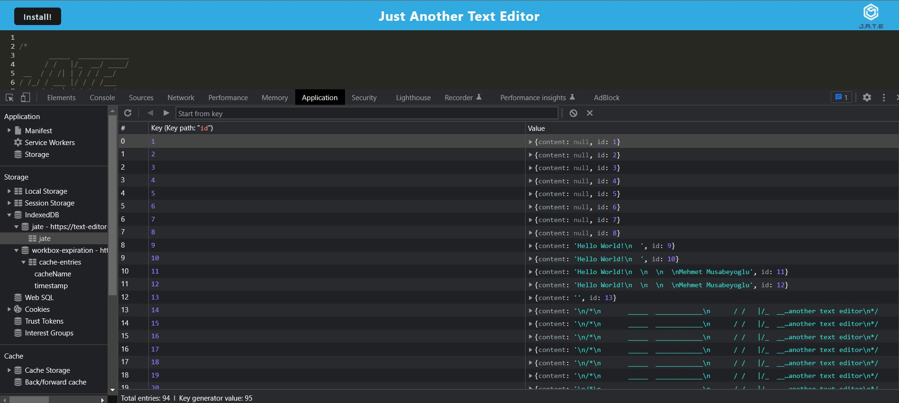

# Text Editor


## Table of Contents

* [Description](#description)
* [Deployed Link](#deployed-link)
* [User Story](#user-story)
* [Screenshots](#screenshots)
* [Code Snippets](#code-snippets)
* [Technologies Used](#technologies-used)
* [Credits](#credits)
* [Author Links](#author-links)
* [License](#license)


## Description

Just Another Text Editor, a.k.a. JATE, is a user friendly progressive web application text editor that works in both online and offline use cases. With JATE, users can create and edit notes directly through their browser or the installed desktop application. Notes taken with JATE are locally stored at an IndexedDB database to ensure data persistence with or without internet connection.  


## Deployed Link

Deployed link is [here](https://text-editor-2022-mm.herokuapp.com/)


## User Story

| As a        | I want to                                                            | So that   
| ----------- | -------------------------------------------------------------------- | -------------------------------------------- |
| `developer` | create notes or code snippets with or without an internet connection | `I can reliably retrieve them for later use` |


## Screenshots

### *Usage Demonstration*

<p align="center">
  
</p>

### *Download Demonstration*

<p align="center">
  
</p>

### *App Manifest*

<p align="center">
  
</p>

### *Service Workers*

<p align="center">
  
</p>

### *IndexedDB Storage*

<p align="center">
  
</p>


## Code Snippets

### PutDb Function:
#### For updating the database with a given data.

```

export const putDb = async (content) => {

  console.log('PUT to the database');
  const jateDb = await openDB('jate', 1);
  const tx = jateDb.transaction('jate', 'readwrite');
  const store = tx.objectStore('jate');
  const request = store.put({ content: content });
  const result = await request;
  console.log('Data saved to the database ✔️', result);

};

```

### GetDb Function:
#### For getting all data from the database.

```

export const getDb = async () => {

  console.log('GET from the database');
  const jateDb = await openDB('jate', 1);
  const tx = jateDb.transaction('jate', 'readonly');
  const store = tx.objectStore('jate');
  const request = store.getAll();
  const result = await request;
  console.log('result.value', result);
  return result.content;

};

```


## Technologies Used

- JavaScript
- Node.js
- Npm Webpack
- Npm Express 
- Npm Idb
- IndexedDB
- Heroku
- Gitbash
- GitHub    
- Screencastify


## Credits

[Npm Webpack](https://www.npmjs.com/package/webpack)

[Npm Idb](https://www.npmjs.com/package/idb)

[Npm Express](https://www.npmjs.com/package/express)

[IndexedDB](https://developer.mozilla.org/en-US/docs/Web/API/IndexedDB_API)


## Author Links

[LinkedIn Profile](https://www.linkedin.com/in/mehmet-musabeyoglu)

[GitHub Profile](https://github.com/MehmetMusabeyoglu)

[E-mail Address](mailto:mehmetmusabeyoglu@gmail.com) 

[Medium Profile](https://medium.com/@mehmetmusabeyoglu) 


## License 

 This project is licensed under the MIT License 
 <br>
 [](https://opensource.org/licenses/MIT)


